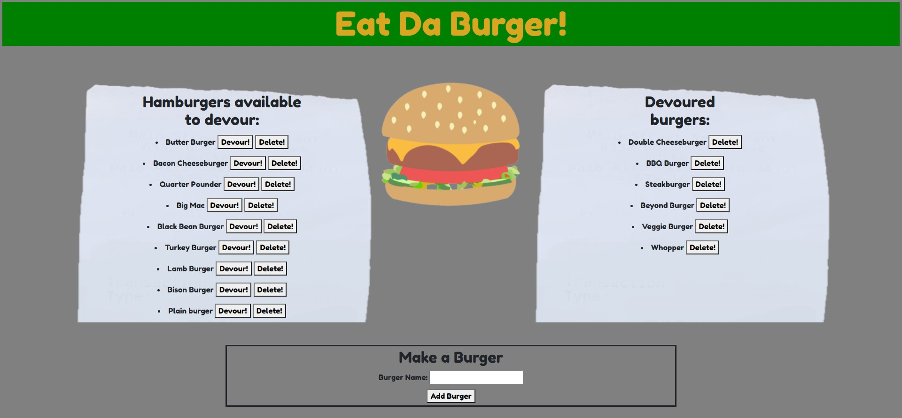

# Eat-Da-Burger

    
## Description
    
This fun application allows users to digitally devour delicous burgers!

Hungry folks can make a burger by entering their burg's name at the bottom. Once submitted, the burger is added to the receipt and is available to be devoured. Just click the "Devour!" button, and it'll move the burger to the Devoured Burgers receipt.

This application uses a MySQL database to store the burgers entered by the user and keep track of which have been devoured and which are still available. Handlebars is also used, along with MVC. 
       

## Table of Contents
    
* [Installation](#installation)
    
* [Usage](#usage)
    
* [Contributions](#contributions)
    
* [Tests](#tests)
    
* [License](#license)
    
* [Contact](#contact)
    
    
## Installation
    
If running application locally, this requires "npm i" in the command terminal to install dependencies.
    
    
## Usage
    
The deployed application can be found here: https://eatin-da-burg.herokuapp.com/

Homepage:

    
## Contributions
    
Contributions are welcome in the form of suggestions.
    
    
## Tests
    
There are no test procedures for this application.
    
    
## License
None
    
    
## Contact
Questions? Contact me at:
 
GitHub username: diane-furlong  
Email address: dfurlongm@gmail.com
